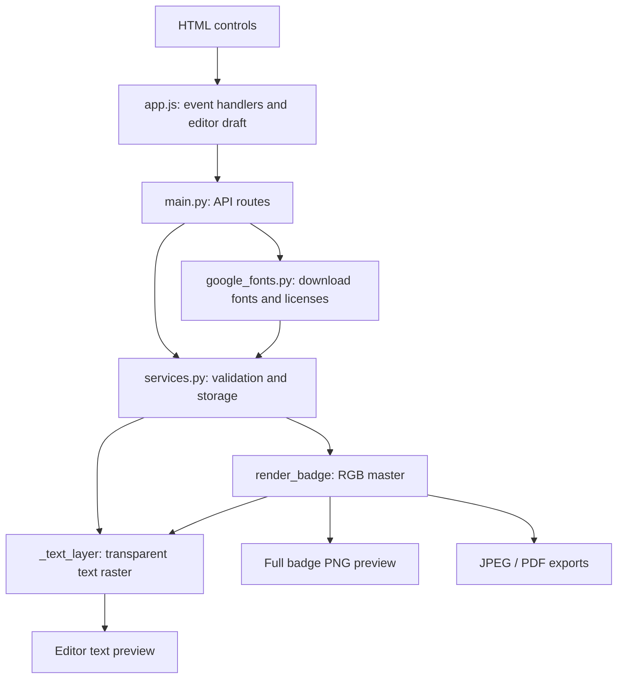

# Code guide

## Start here

| File | Responsibility | Key entry points |
| --- | --- | --- |
| [app/static/index.html](../app/static/index.html) | Page sections, editor controls, and dialogs | Control IDs connect HTML to JavaScript event handlers |
| [app/static/app.js](../app/static/app.js) | Browser state, editor interactions, and API requests | `openEditor`, `renderEditor`, `beginTransform`, `saveLayout` |
| [app/static/styles.css](../app/static/styles.css) | Page layout, editor handles, and dialog appearance | `.editor-grid`, `.editor-box`, `.editor-text-sample`, `.editor-header` |
| [app/main.py](../app/main.py) | HTTP routes, uploaded files, and response types | `/api/import`, `/api/templates/{template_id}/layout`, preview/export routes |
| [app/security.py](../app/security.py) | Image normalization, path containment, font IDs, and resource limits | `decode_image`, `normalize_image`, `asset_path` |
| [app/http_security.py](../app/http_security.py) | Request size limits before multipart parsing and response headers | `UploadLimitsMiddleware` |
| [app/services.py](../app/services.py) | Template persistence, attendee validation, rendering, and exports | `create_event`, `save_template_layout`, `_text_layer`, `render_badge` |
| [app/export_jobs.py](../app/export_jobs.py) | Background batch exports and progress | `start`, `active`, `get`, `download` |
| [app/google_fonts.py](../app/google_fonts.py) | Official OFL/Apache/UFL downloads and local cache | `ensure_font`, `family_id` |
| [app/typography.py](../app/typography.py) | Unicode fallback, shaping and rasterization | `FontResolver`, `SizedFont`, `render_text` |

The two main rendering functions are **`render_badge()`** for a complete badge and
**`_text_layer()`** for text. The main editor functions are **`renderEditor()`** for
displaying the draft and **`beginTransform()`** for changing its geometry.

## How the pieces connect



### Import event data

1. The `#import-form` handler uploads CSV/XLSX and optional avatar files.
2. `main.import_event()` calls `attendee_file_to_csv()` and then `create_event()`.
3. `create_event()` validates and normalizes PNG/JPEG avatars, validates the rows, matches avatar filenames to Ticket IDs, and
   selects the template for each Tier.
4. The server writes `event.json` and returns a summary for the badge dropdown.

CSV and XLSX share the same importer. Barcode content remains in the `qr_token`
column, regardless of the selected barcode type.

### Edit layout, history, and saving

- `openEditor()` fetches a manifest and initializes the `editor` object.
- `editor.manifest.elements` holds layer geometry and appearance. Its array order
  controls the paint order in the final badge.
- `beginTransform()` converts pointer movement from screen pixels to millimetres.
- Property input handlers update the same draft and refresh `renderEditor()`.
- `rememberEditor()` and `restoreEditor()` manage snapshots of elements and fonts.
- `hasUnsavedLayout()` compares the current snapshot with `savedSnapshot`.
- `saveLayout()` sends the draft to `save_template_layout()`. The latter validates
  a staged copy and replaces the custom Tier folder.
- `requestEditorClose()` handles both X and Escape and opens the unsaved changes dialog.

Preview names, Ticket IDs, and attendee selection are display-only state. They are
excluded from layout snapshots and do not rewrite imported attendee records.

### Text rendering: the shared core

The editor sends draft text settings through `renderTextPreview()` to
`editor_text_preview()`. The backend calls `_text_layer()` and returns a transparent
PNG. Draft previewing does not save the layout.

`render_badge()` also reaches `_text_layer()` through `_draw_text()`. That shared
function selects fonts, wraps lines, reduces font size when necessary, and applies
spacing and alignment. Change typography there to keep both preview paths consistent.

`_font_asset()` resolves the selected family/style to a template asset. Missing styles
use the regular face. `typography.render_text()` normalizes Unicode, keeps grapheme
clusters intact, and uses `FontResolver` to fill missing glyphs with Google Noto fonts.
An unsupported visible character raises an error with its Unicode code point.
`SizedFont` uses HarfBuzz for glyph shaping and FreeType for drawing. Variable weight
axes are set to 400/700 at runtime; original font files remain unchanged. The binary
size search measures the same shaped text that it draws.

The frontend caches text rasters for the current layer settings. Moving or rotating
a layer reuses its raster. Typing and resizing wait 120 ms before requesting a new
render; cancellation and identity checks prevent an older response replacing a newer one.

### Google and uploaded fonts

`google_fonts.ensure_font()` accepts a family ID or Google Fonts specimen URL. It
fetches metadata, an original TTF, and OFL.txt, LICENSE.txt, or UFL.txt only from Google's
font repository. It checks `ofl/`, `apache/`, then `ufl/`, trying the next directory
only when metadata returns 404.
The local cache serves subsequent requests without internet. `add_google_font()`
passes the font and license to `add_template_font()`, which copies both into the
selected template. Per-style `origins` preserve source URLs and license asset paths;
uploaded styles are marked separately and never inherit a Google license.
For a Regular request, families with only italic faces use Italic. The cache records
the applied `style`, and the download API returns it so the editor selects the matching
font asset. Explicit Italic requests still require an italic face.

Font downloads/uploads happen immediately. Assignments remain in the editor draft
until **Save layout**; undo/discard does not delete the stored asset. JSON exports
include template fonts and licenses, but not the shared automatic fallback cache.
The Fonts panel explains that users need redistribution rights for uploaded files.

### Full preview and print export

`render_badge()` resolves the active Tier template, creates the canvas including
bleed, draws the background, and composites visible layers in order. Existing event
records therefore use newer custom layouts for their Tier.

- `preview()` returns the RGB master as a PNG.
- `export_badge()` creates one Ticket ID's JPG or PDF.
- `_export_jpeg_zip()` creates one JPEG and one single-page PDF per Ticket ID.
- `_export_master_pdf()` combines badges, one per page at the template's physical size.
- `_export_image()` handles RGB output or ICC-based conversion to CMYK.

Batch buttons POST to `/api/events/{event_id}/export-jobs/{mode}/{kind}`, then
poll `/api/export-jobs/{id}`. The renderers report each finished badge and the
finalization stage; a job reaches 100% only after the output file closes successfully.
`export_jobs` allows one background task and retains 20 recent summaries per server
session. `DataManagementMiddleware` also blocks concurrent legacy batch requests
and keeps backup/reset from racing background work. Progress routes use async
handlers so they remain responsive while image work runs in a thread.

The page remembers the task ID in session storage before submission and checks for
an active server task on load. Refresh and lost responses can recover progress
without another POST. Completed files use a native attachment link, avoiding a
large JavaScript Blob. Export progress covers file preparation; the browser manages
download progress separately.

`POST /api/export-jobs/{id}/cancel` requests a cooperative stop. The job remains
active with stage `stopping` until the renderer reaches its next progress callback
and removes the unfinished output. `services.ExportCancelled` skips unnecessary
PDF finalization during cleanup. A request received during finalization also
discards the returned file before the job can be marked complete. Completion and
cancellation are resolved under the job lock; already completed files are kept.
The browser disables Stop while stopping and ignores stale poll responses.

## Data and units

By default, generated data lives under `.badge_data/`. `BADGE_DATA_DIR` overrides
that location.

```text
app/builtin_templates/          Bundled starter manifests
.badge_data/templates/          Custom Tier manifests and assets
.badge_data/events/<event-id>/
  event.json                    Imported attendee records
  assets/                       Uploaded avatars
  masters/                      RGB PNG masters created during ZIP export
  exports/                      ZIP and master PDF downloads
```

Template geometry uses **millimetres** relative to the trim area. Font sizes and
text spacing use **points**. The raster renderer converts these to pixels at the
template PPI. PDF dimensions use points. See [template-manifest.md](template-manifest.md)
for the saved format.

`discover_templates()` also migrates older local manifests and asset names. It is
not a purely read-only operation for legacy data.

## Where to make common changes

| Requested change | Main location |
| --- | --- |
| Add or move an editor control | `index.html`, its ID handler in `app.js`, and `styles.css` |
| Change drag, resize, or rotation | `beginTransform()` |
| Change save prompts or shortcuts | `saveLayout()`, `requestEditorClose()`, and the `keydown` handler |
| Change attendee sample behavior | `sampleOptions()` and the `#editor-sample` handler |
| Change font sizing, wrapping, or alignment | `_text_layer()` and `typography.render_text()` |
| Change avatar crop or masks | `_draw_avatar()`; also review the editor avatar preview |
| Add a barcode format | `barcode_image()`, manifest validation, and the barcode selector |
| Change import validation | `attendee_file_to_csv()`, `create_event()`, and `prepare_record()` |
| Change export colors or packaging | `_export_image()`, `_export_jpeg_zip()`, and `_export_master_pdf()` |

## Verification

```sh
.venv/bin/python -m unittest discover -s tests -v
node --check app/static/app.js
node --test tests/*.cjs
```

`test_text_preview.py` compares editor text pixels with the corresponding region of
a finished badge. `test_google_fonts.py` covers downloads, Unicode fallback, accents, and portable template
exports. Spreadsheet and barcode behavior have separate test modules. Browser layout
and interactions still need browser checks when their behavior changes.

`test_upload_security.py` covers disguised files, damaged and oversized images,
legacy image reads, alpha/DPI/orientation preservation, template resources, font
path traversal, multipart and chunked request limits, and JPG/PDF/ZIP exports.
Its fixtures are harmless and memory-limit checks use small images or intercepted
allocations. It does not exercise native-code exploits.
