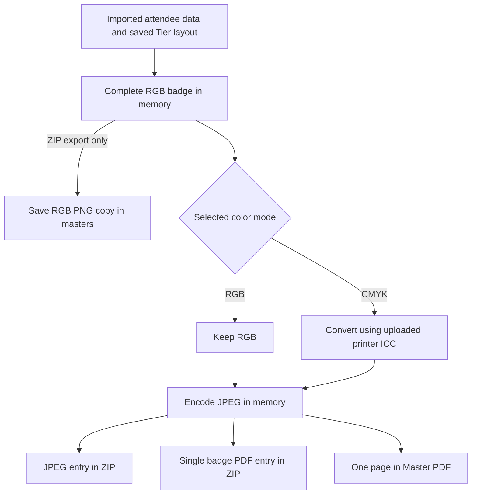

# How Badge Generation Works

This guide explains how attendee data becomes a finished badge, why the app saves
PNG masters, and what happens during export, download, and cancellation.

The app first builds each badge as a complete RGB image. It then prepares JPEG
and PDF output in your selected color mode. The `masters` folder holds RGB PNG
copies created during ZIP export; the `exports` folder holds the final ZIP and
combined PDF files.

## 1. Import attendee data and avatars

Upload a CSV or XLSX spreadsheet with these columns:

| Column | Used for |
| --- | --- |
| `ticket_id` | Identifying each badge and matching its avatar |
| `display_name` | The attendee's displayed name |
| `tier` | Selecting the badge's Tier layout |
| `qr_token` | The content encoded in the QR Code or other barcode |

You can also select an avatar folder. An image named `A001.png`, `A001.jpg`, or
`A001.jpeg` can match the attendee with Ticket ID `A001`.

The app validates the spreadsheet, stores the attendee records in `event.json`,
and saves processed copies of the uploaded avatars under `assets`. Each successful
import creates a new event folder. Editing your original spreadsheet or avatar
folder afterward does not update the imported event; import the corrected files
again to use those changes.

If a Tier has avatars enabled, attendees without a matching image appear in the
**Missing avatars** list. You can still preview and export those badges, with
their avatar area left empty.

## 2. Build the complete RGB badge

When you preview or export a badge, the app combines:

- The attendee's imported details and matching avatar.
- The Tier's saved layout, background, fonts, and artwork.
- The layout's print dimensions, resolution, and bleed settings.

The app draws the background and each visible layer in order. Later layers appear
above earlier ones. Text, avatars, artwork, and barcodes become one complete RGB
image in memory.

**Save layout changes before previewing or exporting.** Exports use saved layouts;
an unsaved editor draft is not included. A new export uses the saved Tier layouts
available when that batch starts.

The complete image is a raster image: it contains pixels, with no editable text
or separate layers. Its resolution follows the template's PPI setting, meaning
pixels per inch. The image includes the bleed area around the badge's trim size.

## 3. Export JPEG + PDF ZIP

Click **Download JPEG + PDF ZIP** to get a separate JPEG and a separate PDF for
every attendee.

For each badge, the app:

1. Builds the complete RGB image.
2. Saves an RGB PNG copy to `masters/<Ticket ID>.png`.
3. Keeps the image in RGB, or converts it to CMYK using your uploaded ICC profile.
4. Encodes the image as JPEG.
5. Writes that JPEG into the ZIP.
6. Places the same JPEG image on a single PDF page and writes that PDF into the ZIP.
7. Updates the progress count and moves to the next attendee.

The ZIP is built as badges are processed. After the last badge, the app finishes
writing and closes the ZIP before marking it ready for download.



The diagram shows the two available export paths. Each button starts its own
batch; the ZIP button creates the ZIP entries, and the Master PDF button creates
the combined document.

For example, a CMYK ZIP contains:

```text
cmyk-jpeg/
  A001.jpg
  A002.jpg
cmyk-pdf/
  A001.pdf
  A002.pdf
```

An RGB ZIP uses `rgb-jpeg` and `rgb-pdf` instead. Filenames are based on Ticket ID;
characters unsuitable for filenames are replaced. The app rejects a ZIP export if
two Ticket IDs would produce conflicting filenames.

### Why save the master as PNG?

PNG preserves the pixels of the complete RGB badge without adding JPEG compression
loss. This gives the app a saved copy of the image before the final color conversion
and JPEG encoding.

The saved PNG is always RGB, including when you choose CMYK export. The CMYK
conversion happens afterward. The export continues from the image already in
memory; it does not reopen the saved PNG to generate the JPEG or PDF.

These PNG files stay in the app's `masters` folder and are excluded from the
downloaded badge ZIP.

### What happens to color and image quality?

| Export mode | Conversion and JPEG profile |
| --- | --- |
| RGB | Keeps the RGB image and embeds an sRGB ICC profile in the JPEG. No profile upload is required. |
| CMYK | Treats the RGB image as sRGB, converts it through your uploaded ICC/ICM profile to CMYK, and embeds that profile in the JPEG. |

JPEG encoding uses quality setting `95` and disables chroma subsampling, which
avoids reducing the resolution of color detail. JPEG is still a lossy format;
the quality setting is an encoder setting, not a percentage of retained quality.

## 4. Export Master PDF

Click **Download Master PDF** to create one PDF containing all attendees, with one
badge per page.

For each attendee, the app builds a fresh RGB badge, applies the selected color
mode, encodes a JPEG in memory, and places that image on the next PDF page. After
the last badge, it saves the combined PDF in `exports`.

This path does not create or update PNG files in `masters`. It also does not read
existing PNG masters or an earlier ZIP. If you export a ZIP and then a Master PDF,
the app renders the badges separately for each export.

The name **Master PDF** means the combined document. It is separate from the
`masters` folder of individual PNG images.

## 5. Understand what the PDF contains

Both the individual PDFs and the combined Master PDF contain complete badge
images. Text and barcodes are already part of those images; they are not separate
vector objects or selectable PDF text. Wrapping the image in a PDF does not
increase its resolution.

Each page uses the badge's physical size, including bleed. For example:

- Trim size: **90 × 125 mm**.
- Bleed: **3 mm** on each edge.
- PDF page size: **96 × 131 mm**.

The app puts one badge on each page. Arranging multiple badges on a larger print
sheet is a separate step. See the README's [printing notes](../README.md#printing-caveat)
for output formats and printer workflow details.

## 6. Follow export progress

Starting a batch export immediately disables both batch download buttons. The
server also blocks another batch export from starting in a different tab.

The progress panel shows:

- How many badges have been generated.
- A completion percentage that leaves room for final file preparation.
- Elapsed time.
- Approximate remaining time based on the current rendering speed.

The first badge may take longer, especially if fonts need downloading. The estimate
updates as work progresses. During final ZIP or PDF writing, the panel shows a
finalization message because that step has no reliable countdown.

**100% means the export file is ready.** Your browser then handles downloading and
saving it. Check the browser's downloads to confirm that transfer has finished.

The completion panel also provides a download link. Using that link downloads the
prepared file again without regenerating badges. Large files are sent directly to
the browser's download system.

Rendering layers, saving PNG masters during ZIP export, converting colors, encoding
JPEGs, and writing PDFs and archives all take time. Larger badge images and larger
attendee lists increase the work required.

## 7. Stop an export to make corrections

Click **Stop export** in the progress panel if you need to correct something.

1. The panel changes to **Stopping…** and disables the stop button.
2. The current badge or file operation finishes before the worker stops.
3. The app removes this task's unfinished ZIP or PDF.
4. The panel shows **Export stopped**, and the export controls become available.
5. Save your layout changes or import corrected attendee files, then export again.

The app keeps imported attendee data, avatars, layouts, and previously completed
export files. If the export finished before the stop request arrived, the completed
file remains available for download.

**PNG masters already written during the stopped ZIP export remain on disk.**
Their presence does not mean the whole batch finished. A new export starts from
the beginning and renders the badges again; it does not resume from those PNGs.

## 8. Refreshing, connection loss, and restarting the app

During an export, refreshing or leaving the page requests the browser's standard
confirmation prompt where supported. If you confirm a refresh, the server keeps
working and the page restores the task's progress. After refreshing, use the
prepared download link when the file is ready.

A temporary connection failure causes the page to retry progress checks. It does
not automatically submit another export. If a stop request cannot be confirmed,
the page lets you retry **Stop export** while it continues checking the task.

Restarting the app server interrupts a running task. Task status and links for the
20 most recent tasks are held for the current server session. After a restart,
start a new export if needed; completed files already saved on disk remain there.

## 9. Find your files

The browser saves downloaded files in its configured download location, commonly
your **Downloads** folder. This is separate from the app's stored files.

For a normal local installation, the app uses `.badge_data` inside the project:

```text
.badge_data/
  events/
    <event-id>/
      event.json                 Imported attendee records
      assets/                    Processed copies of uploaded avatars
      masters/
        A001.png                 RGB masters saved during ZIP export
        A002.png
      exports/
        badge-export-…zip        JPEG + individual PDF package
        badge-masters-…pdf       Combined Master PDF
```

The Docker setup uses `/data` inside its persistent data volume. If you configured
`BADGE_DATA_DIR`, that directory replaces the default data location.

When you export a ZIP again for the same imported event, PNG masters with the same
filenames are overwritten as each badge is processed. ZIP and combined PDF names
include a timestamp and a random suffix, so separate exports keep separate files.

Use the completed export's download link for the finished batch. A `masters`
folder may contain images from an earlier or stopped export, and a file being
written in `exports` may still be incomplete.

For installation and usage instructions, return to the [README](../README.md).
For implementation details, see the [code guide](code-guide.md).
